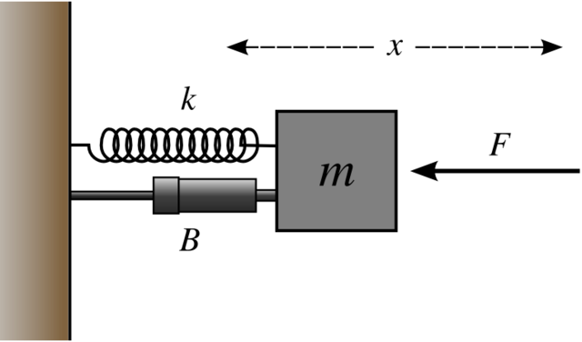
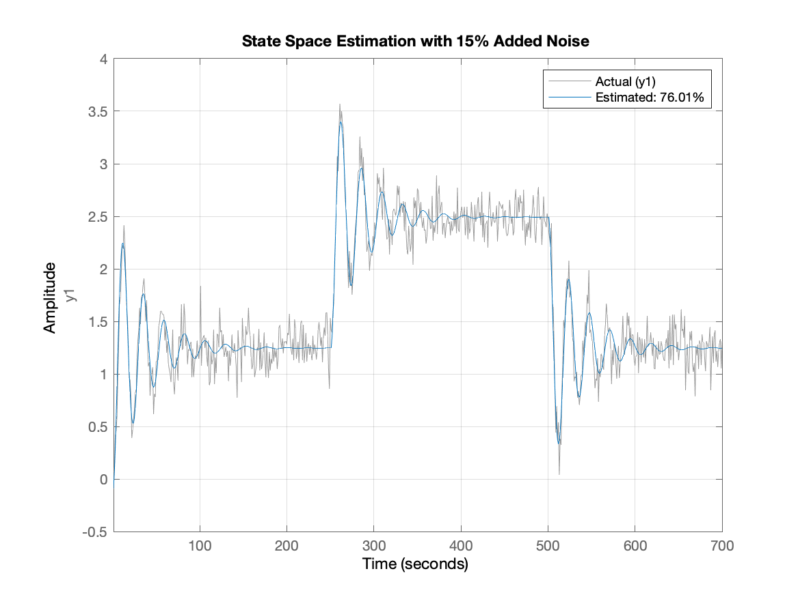
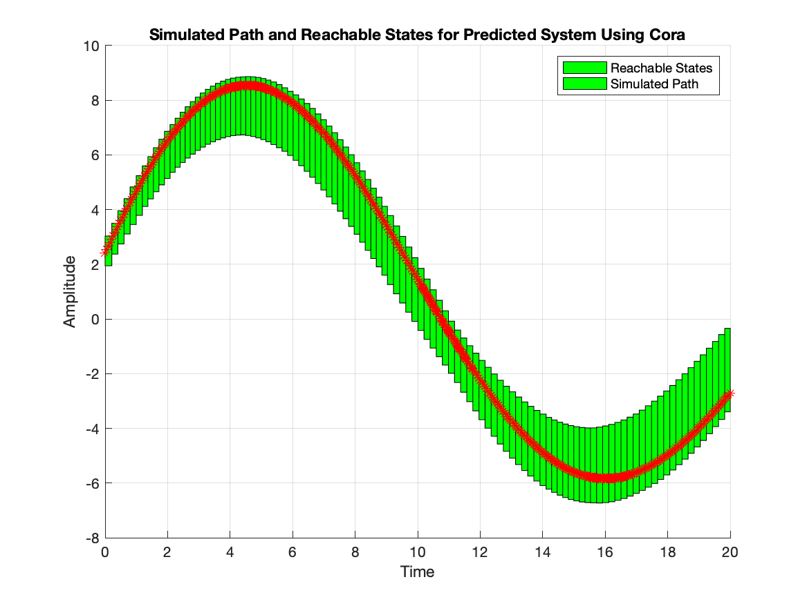
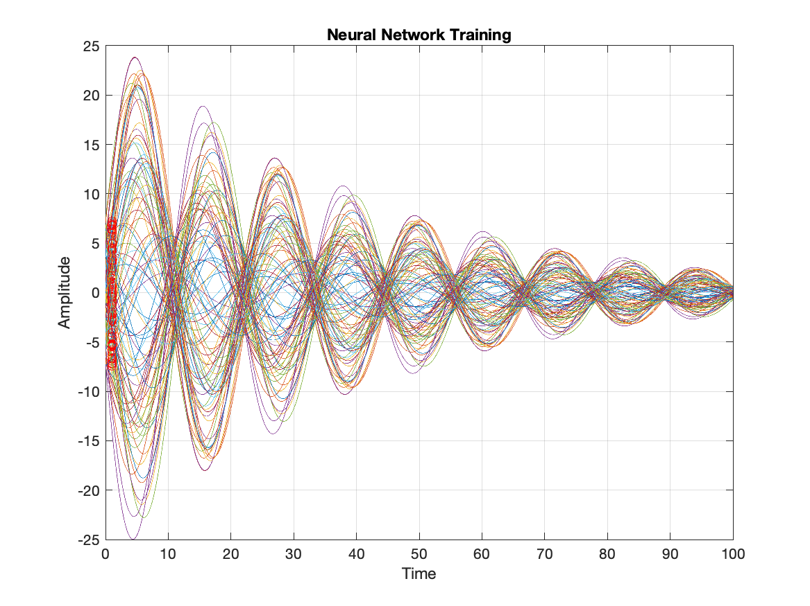
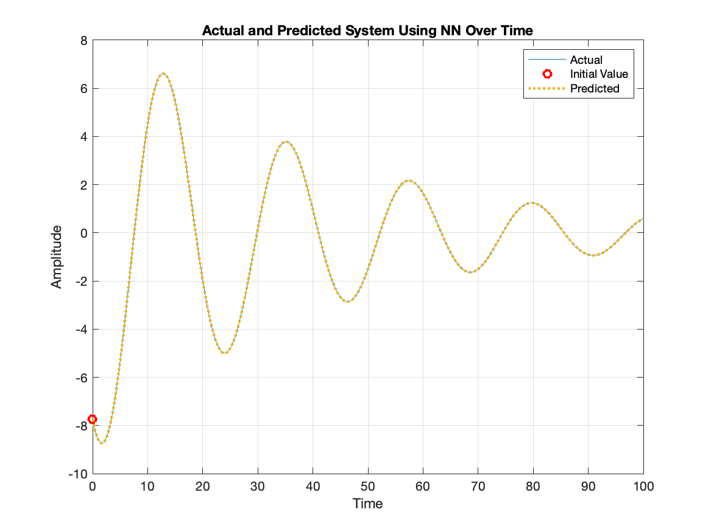
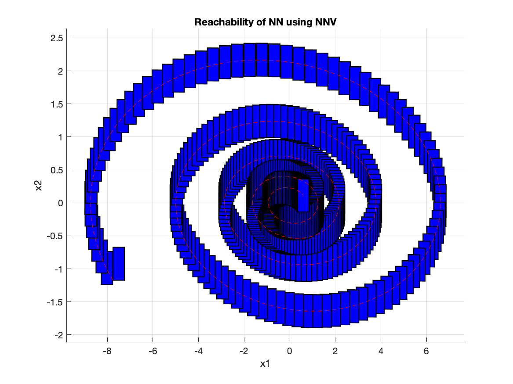

# Spring Mass Damper System

## Dynamics
The spring mass damper system (SMDS) consists of a mass attached to a wall by both a spring and a damper. The forces of motion are in the horizontal (+x, -x) direction, eliminating the effects of gravity on the equations. The figure below shows this system as well as the constants associated with both the spring and the damper.

- `k` : spring constant
- `m` : mass of block
- `b` : damping coefficient
- `F` : Force acting on block
- `x` : displacement of block

### Equations of Motion
F = ma

F - bv -kx = ma
  
### State Space Representation
A = [0 1; -k/m -b/m]

B = [0 1/m]

C = [1 0]

D = [0]

### Transfer Function
G(s) = (1/m)(s^2 + (b/m)s + (k/m))

## Classical System Identification
Using the state space model, traces of the system are generated with:
- m = 10
- k = 0.8
- b = 0.5  
- F = square wave with a period of 500 time units over 1000 time units.

To make the system resemble real-world data, noise is also injected into the output before measurement. After generating the traces with varying levels of noise, the parameters of each are calculated using Matlab's built in **ssest** function. This system identification function estimates a state space model based on the recorded input and output traces. The predicted state space model can then be compared to the actual model on new data. The predicted model for 15% added noise is shown below.

### CORA Reachability
Reachability calculation using CORA is shown below.

## Neural Network System Identification
We used the same parameter values as the classical system to generate training traces for the neural network. 
- m = 10
- k = 0.8
- b = 0.5

We generated 100 different traces at random starting points with the dynamics calculated above over 100 time units. The figure below shows the traces over 100 time units.

After generating the training traces, we constructed a neural network with 1 hidden layer of 10 units. The network is trained using the generated traces and tested on a newly generated starting position and velocity. A comparison of the predicted and actual trajectory is shown below.

### NNV Reachability
 The reachibility of the trained neural network is shown below.
 
 
 
## Files
- `images`: plots generated from sys id and reachability
- `spring-net.mat`: trained neural network for spring mass damper system
- `spring_mass_damp.slx`: simulink model of the system that uses integrals
- `spring_mass_damp_tf.slx`: simulink model of the system that uses a transfer function
- `spring_nn_sys_id`: system identification of the system using neural networks
- `spring_og_sys_id`: system identification of the system using classic techniques.
